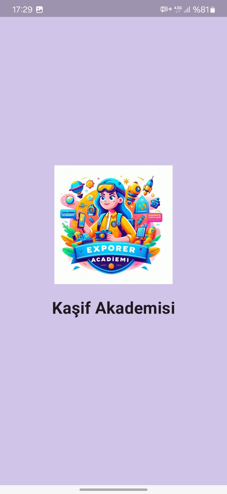
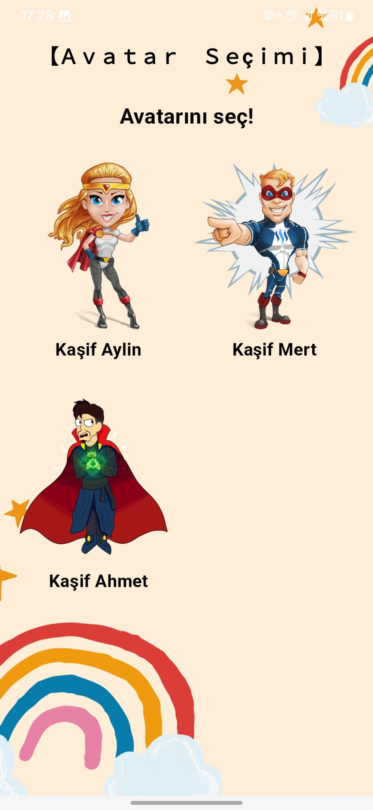
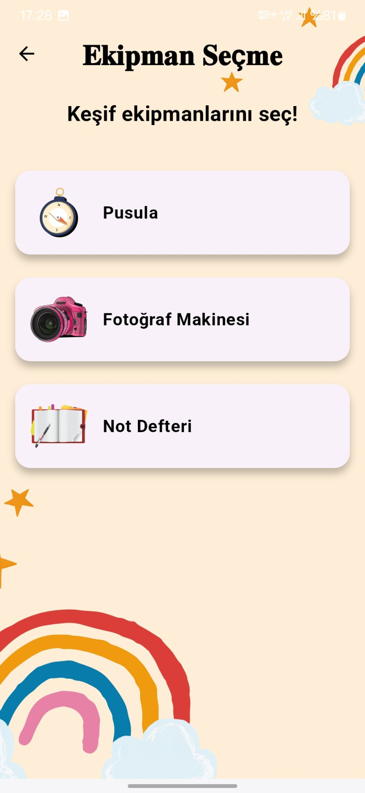
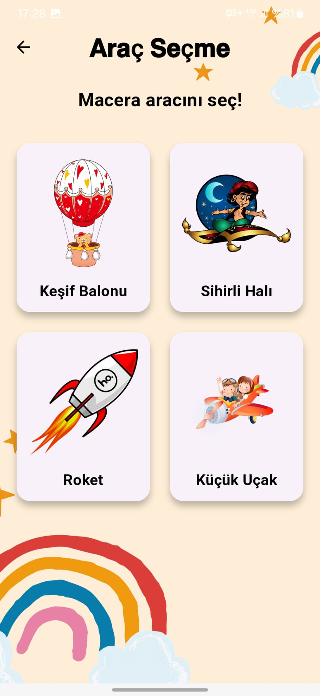
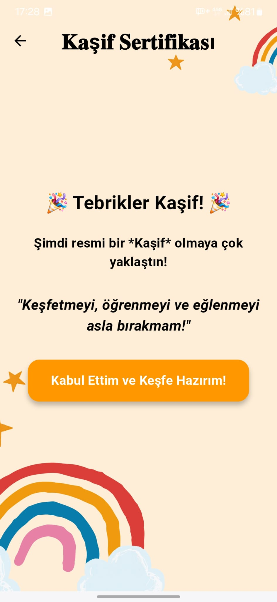
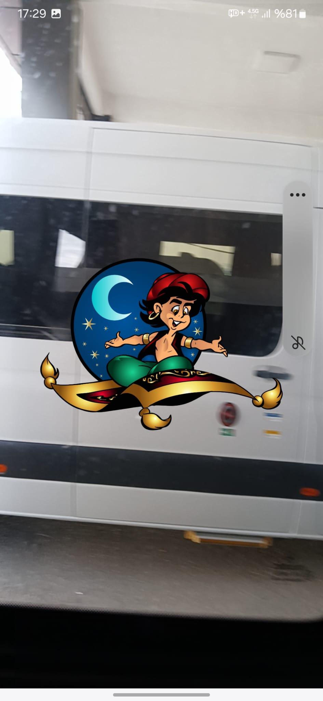

# YMGK - Artırılmış Gerçeklik (AR) Destekli Mobil Oyun

**YMGK**, çocuklar için eğitici ve eğlenceli bir deneyim sunan, artırılmış gerçeklik (AR) teknolojisi ile geliştirilmiş mobil oyun uygulamasıdır. Oyun, çocukların öğrenme sürecini daha etkileşimli hale getirmeyi amaçlarken aynı zamanda onların fiziksel dünyayla bağlantısını artırır.

# 🎯 Proje Amacı

- Artırılmış gerçeklik teknolojisiyle çocuklara yönelik etkileşimli bir oyun ortamı oluşturmak
- Eğitici içerikler ile çocukların motor becerilerini ve problem çözme yeteneklerini geliştirmek
- Mobil cihazlar üzerinden kolay erişim ve kullanım sağlamak

# 🚀 Özellikler

- **AR (Artırılmış Gerçeklik) Teknolojisi**: Gerçek dünya ile dijital içerik birleşimi
- **Eğitici Mini Oyunlar**: Hafıza, dikkat ve el-göz koordinasyonu üzerine oyunlar
- **Renkli ve Çocuk Dostu Ara yüz**: Basit ve sezgisel tasarım
- **Sesli Yönlendirme**: Okuma bilmeyen çocuklar için sesli komutlar

# 🛠️ Teknolojiler

- Dart
- Flutter
- ARCore ve ARKit
- EasyAR
- Flutter AR
- Visual Studio Code

# 📱 Kurulum ve Çalıştırma

## Unity Üzerinden:

1. Bu projeyi klonlayın:
```bash
git clone https://github.com/YnsAltn/ymgk.git
```
2. Unity Hub üzerinden projeyi açın.
3. AR cihazınızı (mobil telefon veya tablet) test cihazı olarak ayarlayın.
4. `Build Settings` üzerinden Android veya iOS seçin ve derleyin.

# 📸 Uygulamadan Görseller

<p align="center">
  
  
  
</p>
<p align="center">
  <em>Çocukları karşılayan ilk ekran</em> &nbsp;&nbsp;&nbsp;&nbsp;
  <em>Avatar seçim ekranı</em> &nbsp;&nbsp;&nbsp;&nbsp;
  <em>Ekipman seçim ekranı</em>
</p>

<br/>

<p align="center">
  
  
  
</p>
<p align="center">
  <em>Araç seçim ekranı</em> &nbsp;&nbsp;&nbsp;&nbsp;
  <em>Kaşif yemini ekranı</em> &nbsp;&nbsp;&nbsp;&nbsp;
  <em>AR sahnesi</em>
</p>

# 👶 Hedef Kitle

- 4-10 yaş arası çocuklar
- Öğrenme güçlüğü yaşayan bireyler için alternatif öğrenme modeli

# 🎥 Proje Tanıtım Videosu

Projemizin genel yapısını, özelliklerini ve kullanım senaryolarını anlatan tanıtım videosunu aşağıdaki bağlantıdan izleyebilirsiniz:

👉 📽️ YMGK Proje Tanıtım Videosu (Google Drive)

## Videoda Neler Var?

- Proje hedefleri ve çözmek istediği problem
- Uygulamanın genel kullanıcı arayüzü tanıtımı
- Avatar, ekipman ve araç seçim ekranları
- AR (Artırılmış Gerçeklik) sahnesinin nasıl çalıştığı
- Örnek kullanıcı deneyimi
  
# 📦 APK İndirme ve Kurulum

Uygulamanın son derlenmiş .apk dosyasına aşağıdaki bağlantıdan ulaşabilirsiniz:

🔗 APK Dosyasını İndir (https://drive.google.com/file/d/1CwGPB_-Vo1cLH0yTTt2JAOTbBXPsTzCU/view?usp=sharing)

## Android Cihazınıza APK Kurulumu:

1. Yukarıdaki bağlantıya tıklayarak .apk dosyasını cihazınıza indirin.
2. İndirme tamamlandıktan sonra, dosyaya tıklayın.
3. Eğer "Bilinmeyen kaynaklardan yükleme" izni açık değilse, ayarlardan izin verin.
4. Yükleme tamamlandığında uygulamayı açabilirsiniz.

-Not: APK boyutu büyük olduğundan ilk açılışta biraz zaman alabilir. AR özelliklerini kullanmak için ARCore destekli bir cihaz kullanmanız gerekir.


# 🤝 Katkıda Bulunmak

1. Bu repoyu fork'layın
2. Yeni bir dal oluşturun: `git checkout -b yeni-ozellik`
3. Değişiklikleri commit edin: `git commit -m "Yeni AR özelliği eklendi"`
4. Dalı pushlayın: `git push origin yeni-ozellik`
5. Pull Request oluşturun

# 📄 Lisans

Bu proje MIT lisansı ile korunmaktadır.

# 👩‍💻 Geliştirici

[Geliştirici Profilleri (GitHub)](https://github.com/YnsAltn)
[Geliştirici Profilleri (GitHub)](https://github.com/kilicarslanokan)
